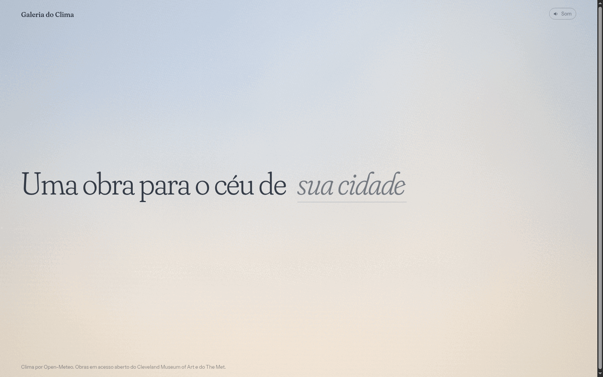

# Galeria do Clima

Uma galeria de arte guiada pelo clima em tempo real: digite uma cidade e a página monta um céu 3D correspondente ao clima atual e exibe uma obra de arte em acesso aberto do The Met ou do Cleveland Museum of Art.

<p align="center">
  
</p>

## Como rodar

```bash
python -m http.server
```

Depois acesse [http://localhost:8000](http://localhost:8000).

## APIs usadas

- [Open-Meteo](https://open-meteo.com/) — geocoding e previsão do tempo
- [The Met](https://metmuseum.github.io/) e [Cleveland Museum of Art](https://openaccess-api.clevelandart.org/) — obras de arte em acesso aberto
